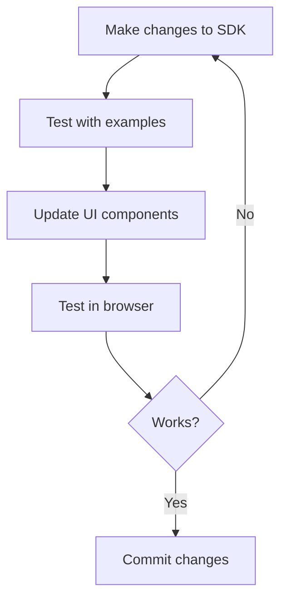

# Sonalex Quickstart Guide

Get started with Sonalex + Percolator integration in minutes.

## What You Have Now

✅ **Sonalex Frontend** - Next.js UI with 3 interfaces (Trader, LP, Admin)
✅ **Percolator SDK** - Complete TypeScript SDK for interacting with Percolator
✅ **Integration Plan** - Clear roadmap for connecting frontend to backend

## Prerequisites

- Node.js 20+ installed
- Solana CLI installed (`solana --version`)
- Rust toolchain installed (`rustc --version`)
- A Solana wallet with devnet SOL

## Quick Start (3 Steps)

### Step 1: Deploy Percolator Programs

```bash
# Navigate to Percolator repository
cd ../percolator

# Build the programs
cargo build-sbf

# Deploy to devnet
solana program deploy target/deploy/percolator_router.so
solana program deploy target/deploy/percolator_slab.so
solana program deploy target/deploy/percolator_amm.so

# Save the program IDs from the output
```

### Step 2: Update SDK Configuration

Edit `sdk/constants/index.ts`:

```typescript
// Replace these with your deployed program IDs
export const ROUTER_PROGRAM_ID = new PublicKey('YOUR_ROUTER_PROGRAM_ID_HERE');
export const SLAB_PROGRAM_ID = new PublicKey('YOUR_SLAB_PROGRAM_ID_HERE');
export const AMM_PROGRAM_ID = new PublicKey('YOUR_AMM_PROGRAM_ID_HERE');
```

### Step 3: Run the Frontend

```bash
# Install dependencies
npm install

# Run development server
npm run dev
```

Visit http://localhost:3000 to see the UI.

## Testing the SDK

### Option 1: Run Example Scripts

```bash
# Navigate to SDK examples
cd sdk/examples

# Run basic usage examples (update program IDs first)
npx tsx basic-usage.ts
```

### Option 2: Test in Browser Console

Open your browser console on http://localhost:3000:

```javascript
import { PercolatorClient, Side, TimeInForce } from '@/sdk';

// Create client
const client = new PercolatorClient({
  connection: new Connection('https://api.devnet.solana.com'),
  routerProgramId: new PublicKey('YOUR_PROGRAM_ID'),
});

// Check if portfolio exists
await client.portfolioExists(wallet.publicKey);
```

## Next Integration Steps

### 1. Add Wallet Provider

Edit `app/layout.tsx` to add Solana wallet provider:

```typescript
import { WalletAdapterNetwork } from '@solana/wallet-adapter-base';
import { ConnectionProvider, WalletProvider } from '@solana/wallet-adapter-react';
import { WalletModalProvider } from '@solana/wallet-adapter-react-ui';
import { PhantomWalletAdapter } from '@solana/wallet-adapter-wallets';

// Import wallet adapter CSS
import '@solana/wallet-adapter-react-ui/styles.css';

export default function RootLayout({ children }) {
  const wallets = [new PhantomWalletAdapter()];

  return (
    <ConnectionProvider endpoint="https://api.devnet.solana.com">
      <WalletProvider wallets={wallets} autoConnect>
        <WalletModalProvider>
          {children}
        </WalletModalProvider>
      </WalletProvider>
    </ConnectionProvider>
  );
}
```

### 2. Connect Trader Interface

Update `app/trader/page.tsx` to use the SDK:

```typescript
'use client';

import { useWallet, useConnection } from '@solana/wallet-adapter-react';
import { PercolatorClient, Side, TimeInForce } from '@/sdk';
import { ROUTER_PROGRAM_ID, SLAB_PROGRAM_ID } from '@/sdk/constants';
import { useState, useEffect } from 'react';

export default function TraderPage() {
  const { connection } = useConnection();
  const wallet = useWallet();
  const [client, setClient] = useState<PercolatorClient | null>(null);

  useEffect(() => {
    const pc = new PercolatorClient({
      connection,
      routerProgramId: ROUTER_PROGRAM_ID,
      slabProgramId: SLAB_PROGRAM_ID,
    });
    setClient(pc);
  }, [connection]);

  async function initPortfolio() {
    if (!client || !wallet.signTransaction) {
      alert('Connect wallet first');
      return;
    }

    try {
      const sig = await client.initializePortfolio(wallet as any);
      console.log('Portfolio initialized:', sig);
    } catch (err) {
      console.error('Error:', err);
    }
  }

  return (
    <div>
      <button onClick={initPortfolio}>
        Initialize Portfolio
      </button>
      {/* Rest of your UI */}
    </div>
  );
}
```

### 3. Test the Flow

1. Open http://localhost:3000/trader
2. Connect your wallet (Phantom)
3. Click "Initialize Portfolio"
4. Check the transaction on Solana Explorer

## Common Issues

### Issue: "Program ID not found"

**Solution**: Make sure you deployed the programs and updated the IDs in `sdk/constants/index.ts`.

### Issue: "Wallet not connected"

**Solution**: Click the "Connect Wallet" button in the UI to connect Phantom.

### Issue: "Insufficient SOL"

**Solution**: Get devnet SOL from faucet:
```bash
solana airdrop 2 YOUR_WALLET_ADDRESS --url devnet
```

### Issue: "Transaction too large"

**Solution**: Portfolio initialization uses `create_with_seed` which bypasses the 10KB limit. Make sure you're using the SDK's `initializePortfolio()` method.

## Development Workflow



## File Structure

```
sonalex/
├── app/                      # Next.js pages
│   ├── trader/              # Trading interface
│   ├── lp/                  # LP interface
│   └── admin/               # Admin interface
├── sdk/                     # Percolator SDK
│   ├── client.ts            # High-level client
│   ├── constants/           # Program IDs, enums
│   ├── types/               # TypeScript types
│   ├── pda/                 # PDA derivation
│   ├── instructions/        # Instruction builders
│   └── examples/            # Usage examples
├── INTEGRATION.md           # Detailed integration guide
└── QUICKSTART.md           # This file
```

## SDK Usage Patterns

### Pattern 1: High-Level Client (Recommended)

```typescript
const client = new PercolatorClient({ ... });
await client.deposit(wallet, { amount: 1_000_000_000n, mint: SOL_MINT });
```

### Pattern 2: Low-Level Instructions

```typescript
import { createDepositInstruction } from '@/sdk';

const ix = createDepositInstruction(user, params, programId);
const tx = new Transaction().add(ix);
// Sign and send manually
```

### Pattern 3: Direct PDA Derivation

```typescript
import { derivePortfolioPda } from '@/sdk';

const { address, bump } = derivePortfolioPda(user, programId);
```

## Resources

- **SDK README**: `sdk/README.md` - Complete SDK documentation
- **Integration Guide**: `INTEGRATION.md` - Detailed integration steps
- **Examples**: `sdk/examples/basic-usage.ts` - Working code examples
- **Percolator Docs**: `../percolator/README.md` - Protocol documentation
- **Percolator CLI**: `../percolator/cli/src/` - Rust reference implementation

## Getting Help

1. Check the SDK README: `sdk/README.md`
2. Review usage examples: `sdk/examples/basic-usage.ts`
3. Inspect Percolator CLI code: `../percolator/cli/src/margin.rs`, `trading.rs`
4. Check Solana Explorer for transaction details

## What's Next?

After completing the quickstart:

1. ✅ SDK is ready to use
2. 🔄 Deploy programs and update IDs
3. 🔄 Add wallet provider to UI
4. 🔄 Connect trader interface
5. 🔄 Connect LP interface
6. 🔄 Connect admin interface
7. 🔄 Add account deserialization
8. 🔄 Add real-time updates
9. 🔄 Add comprehensive error handling
10. 🔄 Write tests

---

**Ready to start?** Follow the 3 steps above and you'll have a working integration in minutes!
